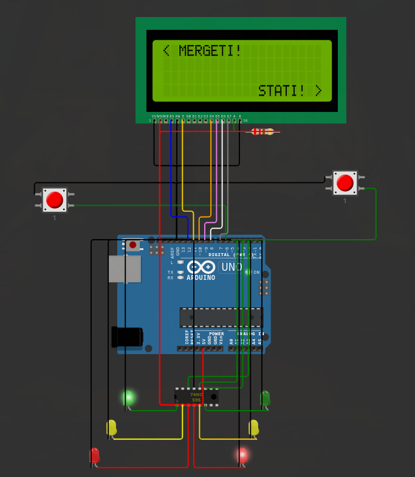

## Smart Traffic Lights System using Arduino UNO

# Short description
This is a small Arduino UNO project written using the WOWKI online website and built IRL for an Introductory Class in Robotics.

